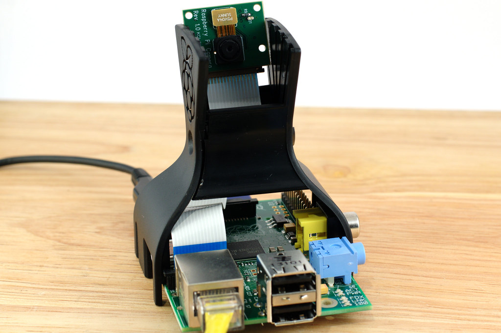

<!-- This is the markdown template for the final project of the Building AI course, 
created by Reaktor Innovations and University of Helsinki. 
Copy the template, paste it to your GitHub README and edit! -->

# Second-Hand data base

Final project for the Building AI course

## Summary

An data base with up to date iformation about the inventory of all second hand stores that wishes to participate. Automated uploads of new items and removal of sold ones 
with an AI based object recognition program for smart phones or perhaps an raspberry pi based camera and set up for easy streamlined photos with plain background. Program detects what kind of item and proposes a price determined by similar items. User can easily change and add description before a one click upload with necessary information like at what store the item is located, what it costs, what condition it is in and when it was uploaded. The set up then prints a QR code that will automatically remove the item from the database when scanned at check out.

## Background

The idea was from the start focused on only books after realizing the enormous amounts of books some second hand stores stash and how much place they take up. The low retail price and low demand in combination with the fact that a lot of people still want to buy books, but more than often a certain one rather than just browsing through the shelves of random books. The environmental aspect of the buy and trash culture we have in the western world needs to change and to combat online retailers second hand stores need to keep up with the conveniences of internet shopping.

List of challenges
* The low margins of second hand stores forces the set up to be very cheap.
* With plenty of smaller stores and personel without expertise in IT the set up needs to be easy and efficient to not cause more problems than it solves.
* The learning curve needs to be small so that the second hand personel is not put off at first try feeling that it would take too much of their time.
* Browsing the database must be user friendly so that it is as easy as the big retailers.
* A system of reservation for the costumers would be optimal so that you don't go to the store just to find the item already gone. A system that is enough flexible so that costumers in the store wont be frustrated with the fact that what they want to buy isn't available.

## How is it used?

The ideal solution is a tiny setup with an integrated computer, camera and, if neccesary, lighting. This in combination with a simple white background, a hanger for clothes and some sort of table to place smaller objects would serve as a form of automated photo booth. The store personal could conveniently just place the item in the setup, a photo would be taken and price, condition, size and other information would be proposed and easily confirmed before the upload to the database. At best it would take no longer than a few seconds more than just unpacking and inspecting the items like normal before putting them up for sale. The QR code would either be printed for each item or there could be reusable "QR-tags" that would be scanned and linked to the item in question.

()
()
()

## Data sources and AI methods
Object recognition. Computer vision.

## Challenges

What does your project _not_ solve? Which limitations and ethical considerations should be taken into account when deploying a solution like this?

## What next?

How could your project grow and become something even more? What kind of skills, what kind of assistance would you  need to move on? 

## Acknowledgments

https://www.flickr.com/photos/120586634@N05/14675164282 "Raspberry Pi Camera Module - Fitted" by ghalfacree is licensed under CC BY-SA 2.0
https://www.flickr.com/photos/54923839@N00/9045741368 "Photography studio" by Dubber is licensed under CC BY-NC-SA 2.0
https://www.flickr.com/photos/25305877@N00/9407153677 "Photography studio snapshot by one of our curators. It is Quaker asylum reformer Dorothea Dix’s St. Elizabeth's Hospital desk from 1887." by national museum of american history is licensed under CC BY-NC 2.0
